# 🧬 Resurrection Screening Agent (v3.0)
### *The Enterprise-Grade AI Hiring Assistant*

[]()
[-blue?style=flat-square&logo=meta&logoColor=white)]()
[]()
[]()

---

## 🚀 Overview
The **Resurrection Screening Agent** is a next-generation Resume ATS (Applicant Tracking System) that eliminates the manual "resume fatigue" problem. Unlike traditional keyword matchers, this system uses a **Hybrid Brain** approach:
1.  **Semantic Intelligence:** Understands that "C++" and "Systems Programming" are related.
2.  **Rule-Based Guardrails:** Enforces strict page limits and format constraints.
3.  **Hiring Manager Persona:** Uses **Llama 3.3** to write detailed, human-like critiques for shortlisted candidates.

---

## 🧠 System Architecture & Workflow

```mermaid
graph TD
    %% User Interaction
    User([👤 Recruiter]) -->|1. Upload JD & Resumes| UI[💻 Frontend Dashboard]
    UI -->|2. POST /analyze| API[⚡ FastAPI Backend]

    %% Data Processing Pipeline
    subgraph Ingestion Layer
        API -->|Parse| PDF[📄 PyPDF Parser]
        PDF -->|Clean| NLP[🧹 Text Sanitizer]
        NLP -->|Anonymize| PII[🛡️ PII Masking]
    end

    %% Intelligence Layer
    subgraph Logic Core
        PII -->|Vectorize| VEC[🧬 ChromaDB Embeddings]
        VEC -->|Compare| SEM[📐 Semantic Similarity]
        
        NLP -->|Extract Keywords| KEY[🔑 Keyword Matcher]
        
        SEM & KEY -->|Compute| SCORE[🧮 Hybrid Score Engine]
    end

    %% Decision Layer
    subgraph Decision Funnel
        SCORE -->|Check Constraints| RULES{⚠️ Hard Rules?}
        RULES -->|Yes: >2 Pages / Corrupt| REJ_HARD[🔴 Hard Rejected]
        
        RULES -->|No| RANK[📊 Rank Candidates]
        RANK -->|Top N Selection| CUTOFF{🏆 Is Top N?}
        
        CUTOFF -->|No| REJ_SOFT[🟡 Not Selected]
        REJ_SOFT -->|Brief Reason| LLM_LITE[🤖 Llama 3.3 Lite]
        
        CUTOFF -->|Yes| SHORT[🟢 Shortlisted]
        SHORT -->|Detailed Analysis| LLM_FULL[🧠 Llama 3.3 Pro]
    end

    %% Output Layer
    LLM_LITE & LLM_FULL & REJ_HARD -->|JSON Response| REPORT[📋 Structural Report]
    REPORT -->|Render| DASH[📈 Interactive Results UI]
```



---

## ✨ Key Features

### 1. **Hybrid Scoring Engine**
Candidates are evaluated on a weighted multi-dimensional scale:
*   **Keywords (25%):** Hard skills match (e.g., Python, Docker).
*   **Experience (20%):** Years of relevant experience vs JD requirements.
*   **Education (10%):** Tier-1 degree verification.
*   **Visuals (30%):** Formatting, whitespace, and presentation quality.
*   **Semantic (15%):** Embedding similarity (Cos Sim) for "meaning" match.

### 2. **Three-Tier Filtering Protocol**
*   **🚫 Hard Rejected (Red):** Automatically blocked for violating constraints (e.g., Junior engineer with a 3-page resume).
*   **🟡 Not Selected (Yellow):** Valid candidates who scored lower than the "Top N". They receive a brief reason for rejection.
*   **🟢 Shortlisted (Green):** The "Cream of the Crop". These profiles get a deep-dive analysis (Strengths, Weaknesses, Interview Questions) by the AI.

### 3. **Robust Engineering**
*   **Zero-Hallucination JSON:** The AI is strictly constrained to output JSON, validated by **Pydantic** models. Regex fallbacks ensure 99.9% parsing reliability.
*   **Privacy First:** Resume data is processed in memory or temp storage and wiped after analysis. PII is redacted before AI processing.

---

## 🛠️ Installation & Setup

### Prerequisites
*   Python 3.10+
*   Node.js (Optional, for dev)
*   Groq API Key (for LLM)

### 1. Clone the Repository
```bash
git clone https://github.com/Prabhat9801/Agentic_ATS_Scorer.git
cd Agentic_ATS_Scorer
```

### 2. Set up Environment
Create a `.env` file in the root directory:
```ini
GROQ_API_KEY=your_groq_api_key_here
```

### 3. Install Dependencies
```bash
pip install -r requirements.txt
```

### 4. Run the System
Start the Backend Server (FastAPI):
```bash
python -m uvicorn Backend.app.main:app --reload
```
*The server will start at `http://127.0.0.1:8000`*

### 5. Launch UI
Simply open `Frontend/index.html` in your browser. No build step required!

---

## 🖥️ Usage Guide

1.  **Input JD:** Paste the Job Description text OR drop a PDF file.
2.  **Upload Resumes:** Drag and drop 1 to 50 resumes at once.
3.  **Set Cutoff:** Choose how many candidates you want to shortlist (e.g., Top 5).
4.  **Analyze:** Click "Run Analysis".
    *   *Wait ~10-30 seconds for AI processing.*
5.  **Review:**
    *   **Recommendation Tab:** See AI feedback for Shortlisted (Green) vs Not Selected (Yellow).
    *   **Detailed Scores:** Sortable table of fit metrics.
    *   **Reports Folder:** Check `Reports/` on disk for permanent records.

---

## 📜 License
MIT License. Open source for educational and enterprise use.

---

### *Refined. Resurrected. Ready to Hire.*
**Built with ❤️ for High-Volume Recruitment**
